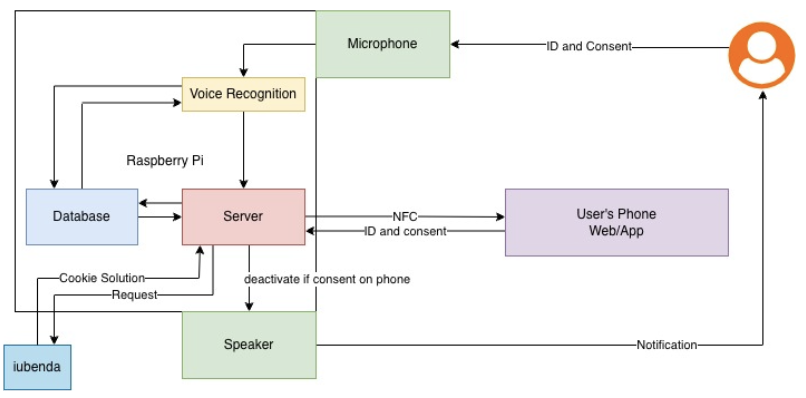
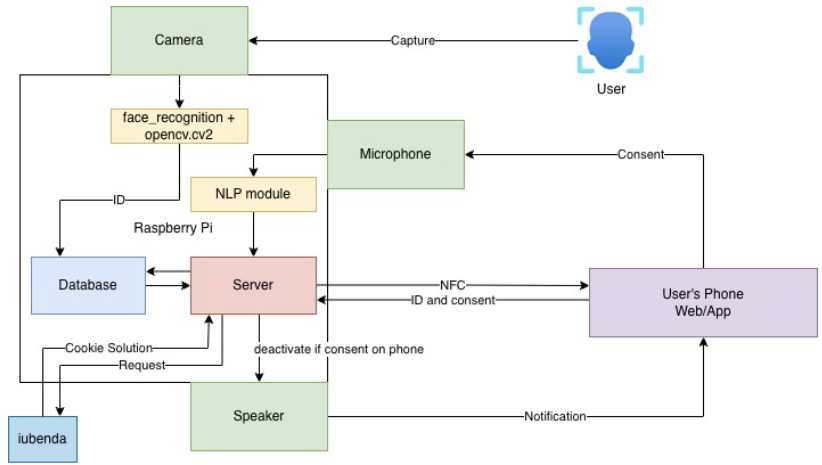

# **Mind the Sensors: Interactive Consent for Smart Environments**

*A multi-modal system enabling transparent, interactive user consent for data collection in smart spaces.*

*A concise, descriptive title for your project.*

  
*(Optional: Replace with a conceptual figure or meaningful image.)*
---

## 👥 **Team**

- **Junyu Liu**
- **Maoqi Xu**
- **Jacob Yang**
- **Mentor:** Brian Wang
- **Professor:** Prof. Mani Srivastava

---

## 📝 **Abstract**

Smart environments often suffer from a lack of transparency, leaving visitors feeling watched rather than served. To address this, we developed "Mind the Sensors," an interactive system that allows users to easily grant or deny data collection consent via natural modalities like voice, camera, and web interfaces. Our approach utilizes a Raspberry Pi-based embedded platform running local facial and voice recognition pipelines to ensure privacy. Key results demonstrate high user trust (4.5/5 average) and ease of use across scenarios, with keyword spotting achieving near 100% accuracy. This project provides building owners and developers with reusable patterns to deploy privacy-respecting smart spaces.

---

## 📑 **Deliverables**

- 📄 [**Midterm Presentation Slides**](./assets/Project11_Midterm_Presentations.pdf)
- 📄 [**Final Presentation Slides**](./assets/Project11_FinalPresentations.pdf)
- 💾 [**Source Code Repository**](https://github.com/your-repo-link) *(Add your repo link here)*

---

# **1. Introduction**

As smart environments become ubiquitous, the need for clear, accessible privacy controls becomes critical. This project introduces a system that empowers users to control their digital footprint in physical spaces.

### **1.1 Motivation & Context**
Current smart space implementations often fail to inform visitors, leading to a feeling of being "watched" or "surveilled." Furthermore, standard consent mechanisms (like website pop-ups) do not translate well to physical spaces. Visitors with disabilities or those without electronic devices at hand are often excluded from digital consent flows.

### **1.2 Goals**
The primary objective is to let people walking into a smart room easily say "yes" or "no" to what sensors collect about them. We aim to:
1.  **Simplify Consent:** Create prompts that work with available modalities—phone, camera, or voice.
2.  **Ensure Persistence:** Ensure the space remembers a user's choice to avoid repetitive prompts.
3.  **Preserve Privacy:** Process biometric data locally without cloud dependency.

---

# **2. Related Work**

Our work builds upon established research in ubiquitous computing, privacy-by-design, and biometric authentication.

### **2.1 Privacy in Smart Spaces**
* **Langheinrich (2001)** established the principles of "Privacy Awareness Systems" in ubiquitous computing, emphasizing the need for notice and consent.
* **Schaub et al. (2015)** proposed a design space for effective privacy notices, arguing that notices must be context-aware and delivered at the right time. Our system implements this by triggering consent requests *only* upon entry or identification.

### **2.2 Biometric Identification**
* **Face Recognition:** We utilize **dlib**'s ResNet models, which achieve 99.38% accuracy on the LFW benchmark. Unlike cloud-based solutions (e.g., AWS Rekognition), our implementation focuses on **edge-based** inference using `face_recognition` and `opencv` to keep data local.
* **Speaker Verification:** We employ **Resemblyzer**, derived from Google's **GE2E (Generalized End-to-End Loss)** model. This allows for real-time voice embedding generation on low-power devices, a significant improvement over older GMM-UBM models.

### **2.3 Legal Compliance Tools**
* **Iubenda:** While mostly used for web compliance, we integrate **iubenda**'s API to manage "Cookie Solutions" and legal policy generation, bridging the gap between physical sensor data and GDPR/CCPA digital compliance requirements.

---

# **3. Technical Approach**

We designed a modular system centered around a Raspberry Pi that orchestrates sensor input, database management, and user feedback.

### **3.1 System Architecture**
The system is built on an embedded platform using a Raspberry Pi, which acts as the central coordinator. To accommodate different user needs, we designed two distinct architectural flows.

#### **3.1.1 Voice-Recognition Architecture**
This flow focuses on identifying users and capturing consent primarily through audio channels, ideal for hands-free interaction.

*Figure 2: Architecture for the voice-based interaction flow. The Microphone captures verbal IDs, processed by the Voice Recognition module, and validated against the Database.*

#### **3.1.2 Facial-Recognition Architecture**
This flow uses a multimodal approach, combining visual identification with verbal consent for higher accuracy.

*Figure 3: Architecture for the camera and voice hybrid flow. The Camera triggers the identification, while the NLP module processes verbal consent.*

### **3.2 Data Pipeline & Database**
We use a lightweight **SQLite** database to store identity and consent status locally. This ensures no sensitive biometric data leaves the device.
* **Table `users`:** Stores `user_id`, `name`, and `permission` (0=first seen, 1=consent, 2=no consent).
* **Table `user_faces`:** Stores 128-d face embeddings as BLOBs.
* **Table `user_voices`:** Stores voice recognition embeddings.

### **3.3 Algorithmic Details**
* **Facial Logic:** Input via `Picamera2` is downscaled 4x for speed. We calculate L2 distance against SQLite records with a strict match threshold of **0.38**. To handle auto-enrollment, we use **Temporal Clustering**: buffering "unknown" encodings and requiring 5 consistent frames within a 3-second window.
* **Voice Logic:** Using **Vosk** for wake-word detection ("Apple") and **Resemblyzer** for biometric verification. Matching uses Cosine Similarity with a threshold of **0.75**.

---

# **4. Evaluation & Results**

We evaluated the system based on **Usability** (User trust/clarity) and **Technical Performance** (Accuracy/Latency).

### **4.1 Usability Testing**
We conducted user studies across two main scenarios. Users rated their experience on a scale of 1-5.

| Metric | Camera Scenario (Avg) | Voice Scenario (Avg) | Notes |
| :--- | :--- | :--- | :--- |
| **Clarity** | 3.5 | **4.5** | Voice prompts were perceived as clearer instructions. |
| **Ease of Use** | 2.5 | **4.0** | Camera positioning caused friction for some users. |
| **Trust** | **5.0** | 4.5 | Visual feedback (seeing the camera) instilled high trust. |

> *Observation:* While the Camera scenario had lower "Ease of Use" due to positioning requirements, it achieved the highest "Trust" score, suggesting users prefer seeing the sensor that is tracking them.

### **4.2 Technical Performance**

#### **Facial Recognition Accuracy**
We tested the system with 20 trial interactions.
* **False Non-match Rate (FNMR):** **0%**. The system never failed to recognize a registered user.
* **False Match Rate (FMR):** **30% (6/20)**.
    * *Analysis:* The FMR was higher than the theoretical baseline because we lowered the threshold to **0.38** to ensure fast detection in varying lighting conditions.

#### **Voice Recognition Accuracy**
* **Keyword Spotting:** **~100%**. No mismatches for simple "yes/no" commands.
* **Biometric FMR:** **15% (3/20)**.

---

# **5. Discussion & Future Work**

Our system successfully demonstrated that complex privacy consent flows can be simplified into natural interactions.

* **Successes:** The multi-modal approach provided robust alternatives. Trust scores were consistently high (4.0-5.0), validating our privacy-first local processing approach.
* **Limitations:** The Facial Recognition FMR (30%) is too high for high-security contexts but acceptable for a consent prototype. Lighting conditions significantly impacted the camera's ability to maintain a lock.
* **Future Work:**
    1.  **Liveness Detection:** Implement blink-detection to prevent photo-spoofing.
    2.  **Adaptive Thresholds:** Dynamically adjust the L2 distance threshold based on ambient lighting.

---

# **6. Reproducibility**

To encourage further development, we have documented our software stack and datasets.

### **Software Stack**
* **Facial Recognition:** `face_recognition`, `opencv-python`
* **Voice Processing:** `sounddevice`, `vosk`, `resemblyzer`
* **Backend:** `Flask`, `SQLite3`
* **Compliance:** `Iubenda` API

### **Datasets**
* **User Encodings:** Collected locally during the demo phase. Stored as 128-d (face) and 256-d (voice) vectors.
* *(Link to your GitHub repo's "data" folder or a sample anonymized database schema)*
